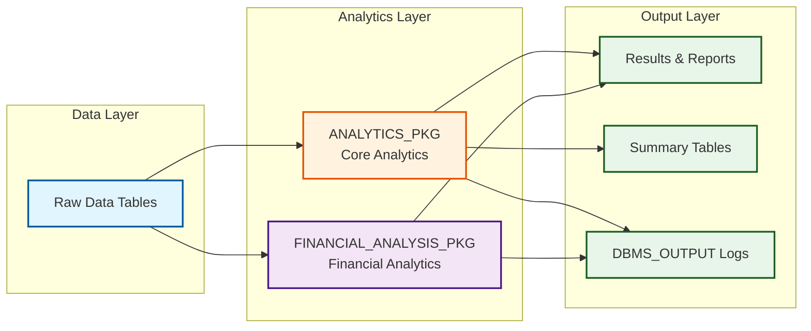
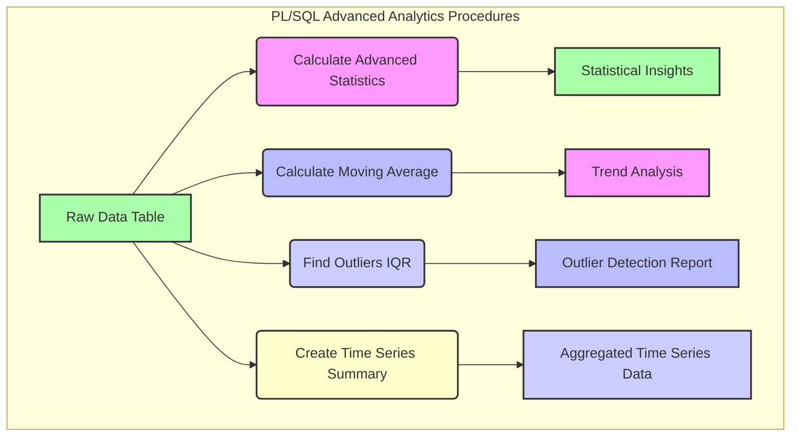

# Advanced Analytics with PL/SQL


---

## 🇧🇷 Analytics Avançado com PL/SQL

Este repositório é dedicado a explorar e demonstrar **técnicas avançadas de analytics e processamento de dados utilizando PL/SQL** no ambiente Oracle Database. O foco é em como desenvolver procedimentos, funções e pacotes PL/SQL eficientes e escaláveis para realizar análises complexas, manipulação de dados e otimização de consultas, aproveitando os recursos nativos do banco de dados para **alta performance e segurança**.

### 🎯 Objetivo

O principal objetivo deste projeto é **fornecer exemplos práticos, código funcional e documentação detalhada** para desenvolvedores e DBAs que buscam aprimorar suas habilidades em PL/SQL para fins analíticos. Serão abordados tópicos como otimização de queries, uso de funções analíticas, criação de packages para modularização, tratamento de grandes volumes de dados e integração com ferramentas de BI, com ênfase em **cálculo de percentis, detecção de outliers e análise de séries temporais**.

### ✨ Destaques

- **Análise Financeira Avançada**: Introdução de um módulo dedicado a análises financeiras complexas, incluindo cálculo de Value at Risk (VaR) e Expected Shortfall (ES) para avaliação de risco de portfólio, e detecção de fraude em transações utilizando z-score para identificar anomalias.
- **Cálculo de Percentis e Estatísticas Avançadas**: Implementação de procedimentos PL/SQL para calcular percentis (e.g., 25º, 50º, 75º, 95º) e outras estatísticas descritivas (média, mediana, desvio padrão) de forma eficiente em grandes conjuntos de dados.
- **Detecção de Outliers (IQR)**: Procedimentos para identificar valores atípicos (outliers) em distribuições de dados usando o método do Intervalo Interquartil (IQR), crucial para a limpeza e validação de dados.
- **Análise de Séries Temporais**: Funções e procedimentos para calcular médias móveis avançadas e sumarizar dados de séries temporais, auxiliando na identificação de tendências e padrões.
- **Otimização de Queries**: Técnicas avançadas para escrever SQL e PL/SQL que executam de forma otimizada, reduzindo o tempo de resposta e o consumo de recursos.
- **Modularização com Packages**: Como organizar o código PL/SQL em packages para melhorar a reusabilidade, manutenibilidade e segurança.
- **Processamento de Grandes Volumes de Dados**: Estratégias para lidar com datasets extensos, incluindo o uso de BULK COLLECT e FORALL.
- **Código Profissional**: Exemplos de código bem estruturados, seguindo as melhores práticas da indústria, com foco em clareza, eficiência e documentação interna.
- **Documentação Completa**: Cada procedimento e função é acompanhado de documentação detalhada, explicando o propósito, parâmetros, lógica e exemplos de uso.
- **Testes Incluídos**: Módulos de código validados através de testes unitários, garantindo a correção e a robustez das implementações.

### 🚀 Benefícios do PL/SQL em Ação

O PL/SQL, combinado com o Oracle Database, oferece uma plataforma poderosa para analytics avançado. Este projeto ilustra como esses benefícios são explorados:

1.  **Performance e Proximidade aos Dados:** A execução de lógica analítica diretamente no banco de dados minimiza a movimentação de dados, resultando em performance superior para cálculos complexos e grandes volumes de dados, como visto nos procedimentos de percentil e outlier.

2.  **Riqueza de Funções Analíticas:** O PL/SQL permite o uso extensivo das funções analíticas do Oracle SQL, que são ideais para tarefas como cálculo de médias móveis, ranqueamento e comparações entre linhas, essenciais para análise de séries temporais.

3.  **Segurança e Governança Integradas:** Ao manter a lógica de negócios e analítica dentro do banco de dados, é mais fácil aplicar políticas de segurança, controle de acesso e auditoria, garantindo a conformidade e a integridade dos dados.

4.  **Modularidade e Reusabilidade:** A capacidade de criar procedures, functions e packages permite a modularização do código analítico, promovendo a reusabilidade e facilitando a manutenção de lógicas complexas.

5.  **Escalabilidade e Confiabilidade:** O Oracle Database é conhecido por sua escalabilidade e robustez, e o PL/SQL herda essas características, tornando-o adequado para ambientes de produção com alta demanda analítica.

---

## 🇬🇧 Advanced Analytics with PL/SQL

This repository is dedicated to exploring and demonstrating **advanced analytics and data processing techniques using PL/SQL** within the Oracle Database environment. The focus is on how to develop efficient and scalable PL/SQL procedures, functions, and packages to perform complex analyses, data manipulation, and query optimization, leveraging native database features for **high performance and security**.

### 🎯 Objective

The main objective of this project is to **provide practical examples, functional code, and detailed documentation** for developers and DBAs looking to enhance their PL/SQL skills for analytical purposes. It will cover topics such as query optimization, use of analytical functions, creation of packages for modularization, handling large volumes of data, and integration with BI tools, with an emphasis on **percentile calculation, outlier detection, and time series analysis**.

### ✨ Highlights

- **Percentile Calculation and Advanced Statistics**: Implementation of PL/SQL procedures to efficiently calculate percentiles (e.g., 25th, 50th, 75th, 95th) and other descriptive statistics (mean, median, standard deviation) on large datasets.
- **Outlier Detection (IQR)**: Procedures to identify anomalous values (outliers) in data distributions using the Interquartile Range (IQR) method, crucial for data cleaning and validation.
- **Time Series Analysis**: Functions and procedures to calculate advanced moving averages and summarize time series data, aiding in the identification of trends and patterns.
- **Query Optimization**: Advanced techniques for writing optimized SQL and PL/SQL that execute efficiently, reducing response time and resource consumption.
- **Modularization with Packages**: How to organize PL/SQL code into packages to improve reusability, maintainability, and security.
- **Large Volume Data Processing**: Strategies for handling extensive datasets, including the use of BULK COLLECT and FORALL.
- **Professional Code**: Well-structured code examples, following industry best practices, with a focus on clarity, efficiency, and internal documentation.
- **Complete Documentation**: Each procedure and function is accompanied by detailed documentation, explaining its purpose, parameters, logic, and usage examples.
- **Tests Included**: Code modules validated through unit tests, ensuring the correctness and robustness of the implementations.

### 📊 Visualization

#### Architecture Diagram



#### Analytics Flow




---

## 🛠️ Tecnologias Utilizadas / Technologies Used

| Categoria         | Tecnologia      | Descrição                                                                 |
| :---------------- | :-------------- | :------------------------------------------------------------------------ |
| **Linguagem**     | PL/SQL          | Linguagem procedural do Oracle para desenvolvimento de lógica de banco de dados. |
| **Banco de Dados**| Oracle Database | Sistema de gerenciamento de banco de dados relacional.                    |
| **Ferramentas**   | SQL Developer / SQLcl | Ambientes de desenvolvimento para interagir com o Oracle Database.        |
| **Testes**        | `utPLSQL`       | (Conceitual) Framework de testes unitários para PL/SQL.                   |
| **Diagramação**   | Mermaid         | Para criação de diagramas de arquitetura e fluxo de dados no README.      |

---

## 📁 Repository Structure

```
plsql-advanced-analytics-procedures/
├── src/
│   ├── core_analytics/      # Procedimentos e funções analíticas gerais
│   ├── financial_analytics/ # Módulos de análise financeira avançada
├── data/                    # Scripts para criação de dados de exemplo e tabelas
├── images/                  # Imagens e diagramas para o README e documentação
├── tests/                   # Scripts de teste para validação das implementações PL/SQL
├── docs/                    # Documentação adicional, tutoriais e guias de otimização
└── scripts/                 # Scripts utilitários para deploy e gerenciamento de objetos de banco de dados
```

---

## 🚀 Getting Started

**⚡ Quick Start**: Para começar rapidamente, veja o [Guia de Início Rápido](docs/QUICK_START.md) (5 minutos)

### Verificação do Ambiente

```bash
# Verificar se você tem tudo necessário
./scripts/check_environment.sh
```

### Pré-requisitos

- Acesso a um ambiente Oracle Database (local ou remoto).
- Ferramenta cliente SQL (e.g., SQL Developer, SQLcl, SQL*Plus).

### Instalação

```bash
git clone https://github.com/GabrielDemetriosLafis/plsql-advanced-analytics-procedures.git
cd plsql-advanced-analytics-procedures

# Conecte-se ao seu banco de dados Oracle usando sua ferramenta cliente preferida.
# Execute os scripts em data/ para criar tabelas de exemplo.
# Execute os scripts em src/ para criar os procedimentos e funções PL/SQL.
```

### Exemplo de Uso Avançado (SQL)

O exemplo abaixo demonstra a criação de tabelas de exemplo e a execução dos procedimentos PL/SQL avançados para cálculo de estatísticas, detecção de outliers e análise de séries temporais, bem como os novos módulos de análise financeira. Este código ilustra como as funcionalidades analíticas podem ser aplicadas diretamente no banco de dados.

```sql
-- Conecte-se ao seu banco de dados Oracle como um usuário com permissões adequadas.

SET SERVEROUTPUT ON;

-- Executar scripts de configuração de dados
-- @data/financial_data_setup.sql

-- Criar tabela de vendas de exemplo (se ainda não existir)
BEGIN
    EXECUTE IMMEDIATE 'DROP TABLE sales_data CASCADE CONSTRAINTS';
EXCEPTION
    WHEN OTHERS THEN
        IF SQLCODE != -942 THEN RAISE; END IF;
END;
/

CREATE TABLE sales_data (
    sale_id NUMBER PRIMARY KEY,
    product_category VARCHAR2(100),
    amount NUMBER(10, 2),
    sale_date DATE
);

INSERT INTO sales_data (sale_id, product_category, amount, sale_date) VALUES (1, 'Electronics', 1200.50, TO_DATE('2024-01-10', 'YYYY-MM-DD'));
INSERT INTO sales_data (sale_id, product_category, amount, sale_date) VALUES (2, 'Books', 45.99, TO_DATE('2024-01-11', 'YYYY-MM-DD'));
INSERT INTO sales_data (sale_id, product_category, amount, sale_date) VALUES (3, 'Electronics', 1500.00, TO_DATE('2024-01-12', 'YYYY-MM-DD'));
INSERT INTO sales_data (sale_id, product_category, amount, sale_date) VALUES (4, 'Clothing', 89.90, TO_DATE('2024-01-13', 'YYYY-MM-DD'));
INSERT INTO sales_data (sale_id, product_category, amount, sale_date) VALUES (5, 'Electronics', 1300.25, TO_DATE('2024-01-14', 'YYYY-MM-DD'));
INSERT INTO sales_data (sale_id, product_category, amount, sale_date) VALUES (6, 'Books', 55.00, TO_DATE('2024-01-15', 'YYYY-MM-DD'));
INSERT INTO sales_data (sale_id, product_category, amount, sale_date) VALUES (7, 'Electronics', 2500.00, TO_DATE('2024-01-16', 'YYYY-MM-DD')); -- Potencial outlier
INSERT INTO sales_data (sale_id, product_category, amount, sale_date) VALUES (8, 'Clothing', 120.00, TO_DATE('2024-01-17', 'YYYY-MM-DD'));
INSERT INTO sales_data (sale_id, product_category, amount, sale_date) VALUES (9, 'Books', 30.00, TO_DATE('2024-01-18', 'YYYY-MM-DD'));
INSERT INTO sales_data (sale_id, product_category, amount, sale_date) VALUES (10, 'Electronics', 100.00, TO_DATE('2024-01-19', 'YYYY-MM-DD')); -- Potencial outlier
COMMIT;

-- Exemplo de uso do procedimento calculate_advanced_statistics
BEGIN
    DBMS_OUTPUT.PUT_LINE(CHR(10) || '--- Calculando Estatísticas Avançadas para AMOUNT na tabela SALES_DATA ---');
    ANALYTICS_PKG.calculate_advanced_statistics('SALES_DATA', 'AMOUNT');
END;
/

-- Exemplo de uso do procedimento find_outliers_iqr
BEGIN
    DBMS_OUTPUT.PUT_LINE(CHR(10) || '--- Detectando Outliers para AMOUNT na tabela SALES_DATA ---');
    ANALYTICS_PKG.find_outliers_iqr('SALES_DATA', 'AMOUNT');
END;
/

-- Criar tabela de preços de ações de exemplo para análise de séries temporais
BEGIN
    EXECUTE IMMEDIATE 'DROP TABLE stock_prices CASCADE CONSTRAINTS';
EXCEPTION
    WHEN OTHERS THEN
        IF SQLCODE != -942 THEN RAISE; END IF;
END;
/

CREATE TABLE stock_prices (
    price_id NUMBER PRIMARY KEY,
    symbol VARCHAR2(10),
    price NUMBER(10, 2),
    price_date DATE
);

INSERT INTO stock_prices (price_id, symbol, price, price_date) VALUES (1, 'GOOG', 100.00, TO_DATE('2024-01-01', 'YYYY-MM-DD'));
INSERT INTO stock_prices (price_id, symbol, price, price_date) VALUES (2, 'GOOG', 102.50, TO_DATE('2024-01-02', 'YYYY-MM-DD'));
INSERT INTO stock_prices (price_id, symbol, price, price_date) VALUES (3, 'GOOG', 101.75, TO_DATE('2024-01-03', 'YYYY-MM-DD'));
INSERT INTO stock_prices (price_id, symbol, price, price_date) VALUES (4, 'GOOG', 105.00, TO_DATE('2024-01-04', 'YYYY-MM-DD'));
INSERT INTO stock_prices (price_id, symbol, price, price_date) VALUES (5, 'GOOG', 103.20, TO_DATE('2024-01-05', 'YYYY-MM-DD'));
INSERT INTO stock_prices (price_id, symbol, price, price_date) VALUES (6, 'GOOG', 106.80, TO_DATE('2024-01-06', 'YYYY-MM-DD'));
INSERT INTO stock_prices (price_id, symbol, price, price_date) VALUES (7, 'GOOG', 107.10, TO_DATE('2024-01-07', 'YYYY-MM-DD'));
INSERT INTO stock_prices (price_id, symbol, price, price_date) VALUES (8, 'GOOG', 108.50, TO_DATE('2024-01-08', 'YYYY-MM-DD'));
INSERT INTO stock_prices (price_id, symbol, price, price_date) VALUES (9, 'GOOG', 109.00, TO_DATE('2024-01-09', 'YYYY-MM-DD'));
INSERT INTO stock_prices (price_id, symbol, price, price_date) VALUES (10, 'GOOG', 110.25, TO_DATE('2024-01-10', 'YYYY-MM-DD'));
COMMIT;

-- Exemplo de uso do procedimento calculate_moving_average_advanced
BEGIN
    DBMS_OUTPUT.PUT_LINE(CHR(10) || '--- Calculando Média Móvel Avançada para PRICE na tabela STOCK_PRICES (janela de 3 dias) ---');
    ANALYTICS_PKG.calculate_moving_average_advanced('STOCK_PRICES', 'PRICE', 'PRICE_DATE', 3);
END;
/

-- Exemplo de uso do procedimento create_time_series_summary
BEGIN
    DBMS_OUTPUT.PUT_LINE(CHR(10) || '--- Criando Sumário de Série Temporal para PRICE na tabela STOCK_PRICES ---');
    ANALYTICS_PKG.create_time_series_summary('STOCK_PRICES', 'PRICE_DATE', 'PRICE');
END;
/

-- Exemplo de uso do módulo de Análise Financeira Avançada
BEGIN
    DBMS_OUTPUT.PUT_LINE(CHR(10) || '--- Executando Análise de Risco de Portfólio para portfolio_returns ---');
    FINANCIAL_ANALYSIS_PKG.portfolio_risk_analysis('PORTFOLIO_RETURNS', 'RETURN_VALUE', 'RETURN_DATE');
END;
/

BEGIN
    DBMS_OUTPUT.PUT_LINE(CHR(10) || '--- Executando Detecção de Fraude em Transações para transactions ---');
    FINANCIAL_ANALYSIS_PKG.transaction_fraud_detection('TRANSACTIONS', 'AMOUNT', 'CUSTOMER_ID');
END;
/

```

---

## 🧪 Testing & Quality Assurance

Este projeto inclui testes abrangentes e validação automática para garantir a qualidade do código.

### Estrutura de Testes

```
tests/
├── test_analytics_procedures.sql       # Testes unitários básicos
└── test_integration_analytics_procedures.sql  # Testes de integração completos
```

### Executar Testes

#### Método 1: Script Automatizado (Recomendado)

```bash
# Executar todos os testes
./scripts/run_tests.sh <usuario> <senha> <connection_string>

# Exemplo
./scripts/run_tests.sh analytics analytics123 localhost:1521/XEPDB1
```

#### Método 2: Manual via SQL*Plus

```bash
# Testes unitários
sqlplus usuario/senha@connection @tests/test_analytics_procedures.sql

# Testes de integração
sqlplus usuario/senha@connection @tests/test_integration_analytics_procedures.sql
```

### Validação de Sintaxe

```bash
# Validar sintaxe de todos os arquivos PL/SQL
python3 validate_plsql.py
```

O validador verifica:
- ✅ Estrutura básica de PL/SQL
- ✅ Pares BEGIN/END balanceados
- ✅ Sintaxe SQL inválida (como `CREATE OR REPLACE TABLE`)
- ✅ Presença de keywords PL/SQL

### Cobertura de Testes

Os testes cobrem:
- ✅ Cálculo de estatísticas descritivas
- ✅ Geração de médias móveis (SMA/EMA)
- ✅ Detecção de outliers com IQR
- ✅ Criação de resumos de séries temporais
- ✅ Análise de risco financeiro (VaR/ES)
- ✅ Detecção de fraude com z-score
- ✅ Validação de entrada e tratamento de erros

---

## 📦 Deployment

### Opção 1: Deploy Automatizado

```bash
# Clone o repositório
git clone https://github.com/galafis/plsql-advanced-analytics-procedures.git
cd plsql-advanced-analytics-procedures

# Execute o script de deploy
chmod +x scripts/deploy.sh
./scripts/deploy.sh <usuario> <senha> <connection_string>
```

O script automaticamente:
1. Valida a conexão com o banco de dados
2. Deploya o pacote `ANALYTICS_PKG`
3. Deploya o pacote `FINANCIAL_ANALYSIS_PKG`
4. Opcionalmente cria dados de exemplo

### Opção 2: Deploy Manual Passo a Passo

```sql
-- 1. Conectar ao banco de dados
sqlplus usuario/senha@connection_string

-- 2. Deploy pacote Core Analytics
@src/core_analytics/analytics_package.sql

-- 3. Verificar criação do pacote
SELECT object_name, object_type, status 
FROM user_objects 
WHERE object_name = 'ANALYTICS_PKG';

-- 4. Deploy pacote Financial Analysis  
@src/financial_analytics/advanced_financial_analysis.sql

-- 5. Verificar criação do pacote
SELECT object_name, object_type, status 
FROM user_objects 
WHERE object_name = 'FINANCIAL_ANALYSIS_PKG';

-- 6. (Opcional) Criar dados de exemplo
@data/financial_data_setup.sql
```

### Verificação Pós-Deploy

```sql
-- Verificar se os pacotes foram criados corretamente
SELECT object_name, object_type, status 
FROM user_objects 
WHERE object_name IN ('ANALYTICS_PKG', 'FINANCIAL_ANALYSIS_PKG')
ORDER BY object_name, object_type;

-- Resultado esperado:
-- ANALYTICS_PKG          PACKAGE        VALID
-- ANALYTICS_PKG          PACKAGE BODY   VALID
-- FINANCIAL_ANALYSIS_PKG PACKAGE        VALID
-- FINANCIAL_ANALYSIS_PKG PACKAGE BODY   VALID
```

---

## 📚 Documentation

### Documentação Disponível

- **[Documentação Completa](docs/DOCUMENTATION.md)**: Guia detalhado de uso, exemplos e troubleshooting
- **README.md**: Este arquivo - visão geral e quick start
- **Comentários no Código**: Cada procedimento é documentado inline

### Estrutura da Documentação

```
docs/
└── DOCUMENTATION.md
    ├── Visão Geral
    ├── Arquitetura
    ├── Instalação e Configuração
    ├── Módulos e Procedimentos
    ├── Exemplos de Uso
    ├── Testes
    ├── Melhores Práticas
    └── Resolução de Problemas
```

---

## 🛡️ Best Practices & Security

### Segurança

✅ **Validação de Entrada**: Todos os procedimentos validam nomes de tabelas e colunas  
✅ **Prevenção de SQL Injection**: Uso de `user_tables` e `user_tab_columns` para validação  
✅ **Tratamento de Erros**: Exception handling robusto em todos os procedimentos  
✅ **Logging**: Mensagens detalhadas via `DBMS_OUTPUT`

### Performance

✅ **Funções Analíticas**: Uso de funções window para performance otimizada  
✅ **Índices Recomendados**: Documentação de índices para melhor performance  
✅ **Bulk Operations**: Uso de BULK COLLECT onde apropriado  
✅ **Particionamento**: Suporte a particionamento de dados

### Manutenibilidade

✅ **Código Modular**: Organizado em packages reutilizáveis  
✅ **Nomenclatura Consistente**: Padrões de nomenclatura claros  
✅ **Documentação Inline**: Comentários explicativos no código  
✅ **Versionamento**: Controle de versão com Git

---

## 🔧 Troubleshooting

### Problemas Comuns

#### Erro: "Tabela não encontrada"
```sql
-- Verificar se a tabela existe
SELECT table_name FROM user_tables WHERE table_name = 'NOME_TABELA';
```

#### Erro: "Package não compilado"
```sql
-- Recompilar package
ALTER PACKAGE ANALYTICS_PKG COMPILE;
ALTER PACKAGE ANALYTICS_PKG COMPILE BODY;

-- Verificar erros
SELECT * FROM user_errors WHERE name = 'ANALYTICS_PKG';
```

#### Performance Lenta
```sql
-- Atualizar estatísticas
EXEC DBMS_STATS.GATHER_TABLE_STATS(USER, 'NOME_TABELA');

-- Criar índice
CREATE INDEX idx_nome ON tabela(coluna);
```

Veja mais em [docs/DOCUMENTATION.md](docs/DOCUMENTATION.md#resolução-de-problemas)

---

## 📈 Roadmap

### Versão 1.1 (Planejada)

- [ ] Suporte a análise de séries temporais com sazonalidade
- [ ] Implementação de testes automatizados com utPLSQL
- [ ] Dashboard interativo com APEX
- [ ] Exportação de resultados para CSV/JSON
- [ ] Integração com ferramentas de BI (Power BI, Tableau)

### Versão 2.0 (Futuro)

- [ ] Machine Learning básico em PL/SQL
- [ ] Análise preditiva
- [ ] Clustering e segmentação
- [ ] API REST para acesso externo

---

## 👥 Contributing

Contribuições são bem-vindas! Para contribuir:

1. Fork o repositório
2. Crie uma branch para sua feature (`git checkout -b feature/AmazingFeature`)
3. Commit suas mudanças (`git commit -m 'Add some AmazingFeature'`)
4. Push para a branch (`git push origin feature/AmazingFeature`)
5. Abra um Pull Request

### Diretrizes de Contribuição

- Siga os padrões de código existentes
- Adicione testes para novas funcionalidades
- Atualize a documentação
- Certifique-se de que todos os testes passam

---

## 📝 Licença

Este projeto está licenciado sob a Licença MIT - veja o arquivo [LICENSE](LICENSE) para detalhes.

---

## 📞 Contact & Support

**Autor:** Gabriel Demetrios Lafis  
**Ano:** 2025  
**GitHub:** [@galafis](https://github.com/galafis)

### Suporte

Para obter ajuda:
1. Consulte a [documentação completa](docs/DOCUMENTATION.md)
2. Verifique as [issues existentes](https://github.com/galafis/plsql-advanced-analytics-procedures/issues)
3. Abra uma nova issue se necessário